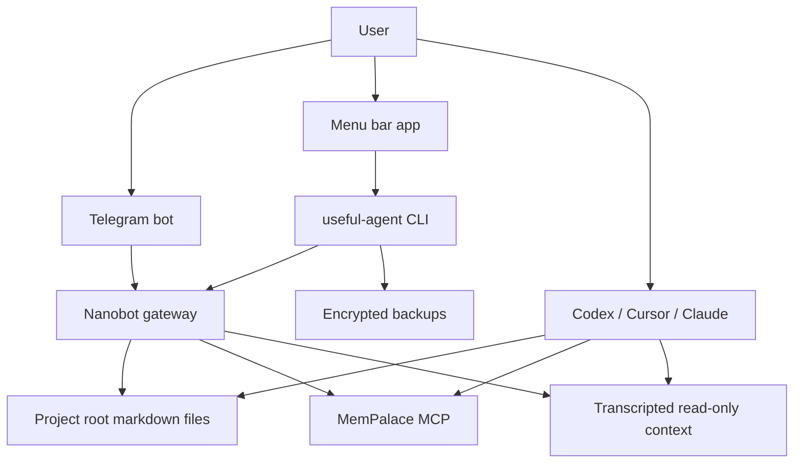

# Architecture

Useful AI Agent is a local operating layer above normal macOS terminal usage
and AI apps.

## Principles

- Files are source of truth.
- Memory retrieves and connects facts; it does not replace files.
- Every agent reads the same router and scoped instructions.
- Backups live outside the working folder.
- UX must work through Telegram/menu bar without requiring terminal fluency.

## Folder Model

- Project root: the user's real files.
- Runtime install root: a Useful Agent folder inside the project.
- Scratch workspace: runtime control files, not a copy of the project.
- Backup vault: encrypted artifacts outside the project.

For Denis's Money setup, the intended runtime install root is
`Money/Harness/useful-agent-runtime`.
